# Cinema Manager Module - Cinema Ticket Booking and Management System

## Overview

This project is a command-line Python application developed as part of an academic group assignment for a Cinema Ticket Booking and Management System. The full group project included multiple user roles, while this repository focuses on the Cinema Manager module and its management features.

The Cinema Manager module allows a cinema manager to manage movie listings, auditoriums, showtime schedules, ticket prices, discount settings, and basic system statistics using a menu-driven command-line interface.

The program uses text-file storage, input validation, functions, loops, conditionals, and basic file handling to simulate simple cinema management operations.

## Team Contribution

The Cinema Manager module work covered:

- Managing movie records
- Managing auditorium records
- Creating, editing, deleting, and listing showtimes
- Setting the base ticket price
- Applying a global discount percentage
- Viewing system statistics for movies, auditoriums, showtimes, and pricing

## Features

- Cinema Manager menu starts directly when the program runs
- Add, update, remove, and list movies
- Add, update, remove, and list auditoriums
- Create, edit, delete, and list showtimes
- Validate movie IDs and auditorium IDs before creating showtimes
- Validate movie duration, auditorium capacity, ticket price, discount percentage, and showtime format
- Prevent deletion of movies or auditoriums that are already linked to showtimes
- Save and load data using text files
- Display a statistics summary of the current system state

## Technologies Used

- Python
- Built-in Python module: `datetime`
- Text file handling with `.txt` files
- Command-line interface using standard input/output

## Project Structure

```text
cinema-manager-module-python/
|-- README.md
|-- requirements.txt
|-- .gitignore
|-- main.py
|-- data/
|   `-- add-data-here.txt
|-- diagrams/
|   |-- main-flowchart.png
|   |-- movies-management-flowchart.png
|   |-- movies-management-flowchart-2.png
|   |-- movies-management-flowchart-3.png
|   |-- auditoriums-management-flowchart.png
|   |-- auditoriums-management-flowchart-2.png
|   |-- auditoriums-management-flowchart-3.png
|   |-- showtimes-management-flowchart.png
|   |-- showtimes-management-flowchart-2.png
|   |-- showtimes-management-flowchart-3.png
|   |-- price-and-discounts-management-flowchart.png
|   `-- statistics-flowchart.png
|-- screenshots/
|   |-- auditoriums-menu.png
|   |-- main-menu.png
|   |-- movies-menu.png
|   |-- price-menu.png
|   |-- showtimes-menu.png
|   `-- statistics-menu.png
`-- documentation/
    |-- add-documentation-here.txt
    `-- static-readiness-check.md
```

## How to Run

1. Open a terminal in the project folder:

   ```bash
   cd cinema-manager-module-python
   ```

2. Install dependencies if needed:

   ```bash
   pip install -r requirements.txt
   ```

   This project currently uses only built-in Python libraries, so no external packages are required.

3. Run the program:

   ```bash
   python main.py
   ```

4. Use the command-line menu to manage movies, auditoriums, showtimes, ticket prices, discounts, and statistics.

## Screenshots

The `screenshots/` folder contains command-line screenshots of the main menu and cinema manager feature menus.

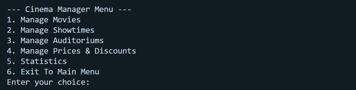

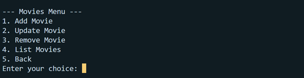

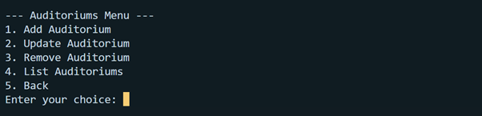

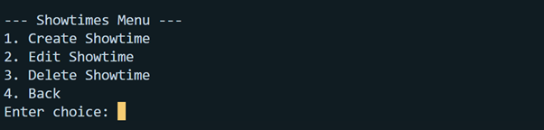

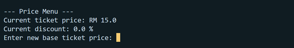

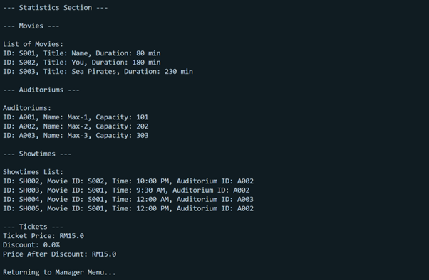

## Diagrams

The `diagrams/` folder contains flowchart images that document the main program flow and cinema manager workflows, including movies, auditoriums, showtimes, pricing and discounts, and statistics management.

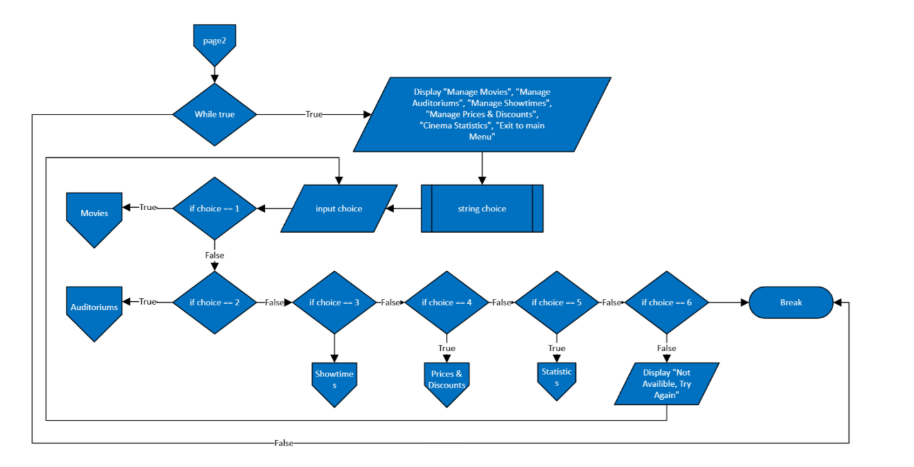

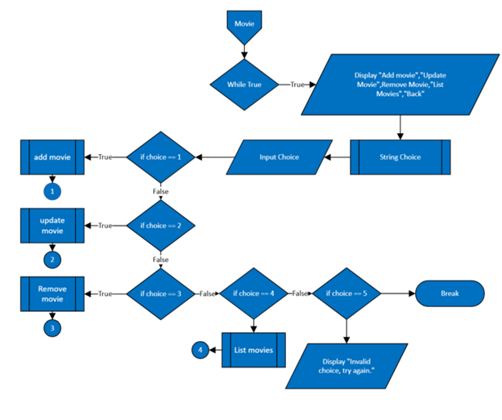

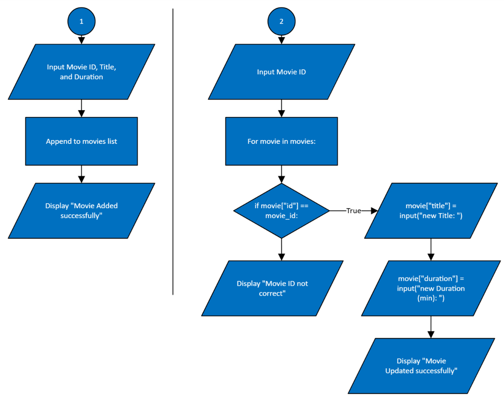

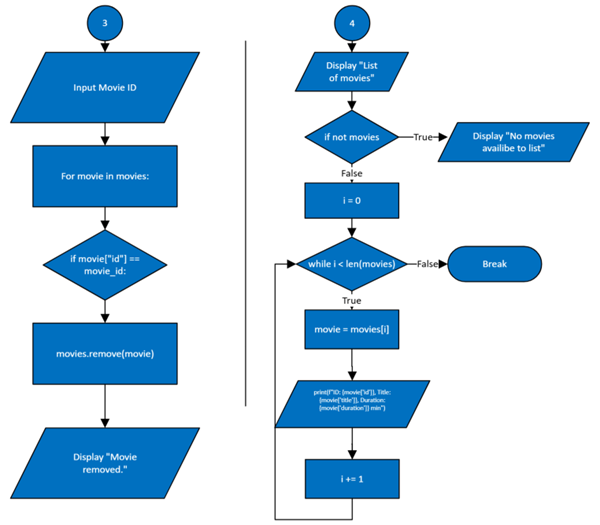

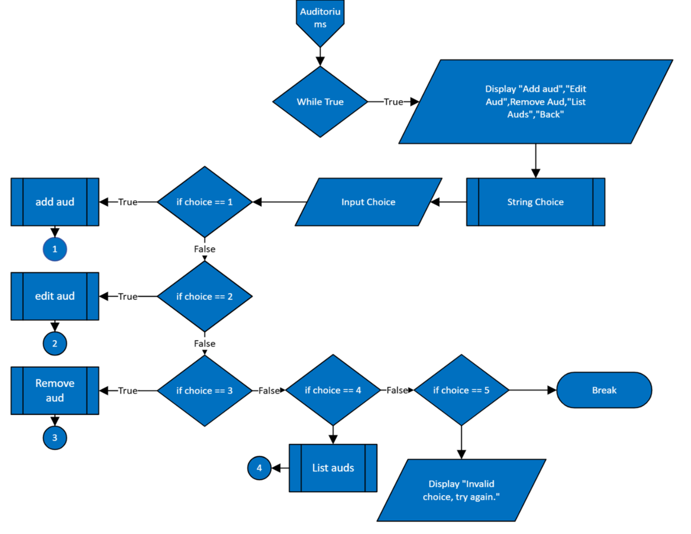

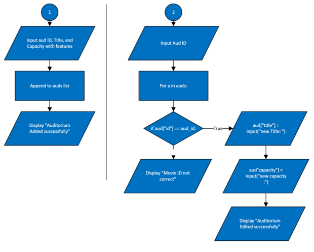

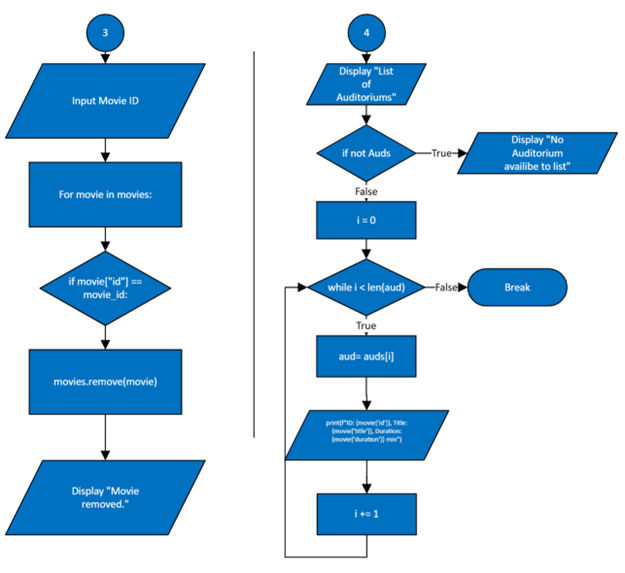

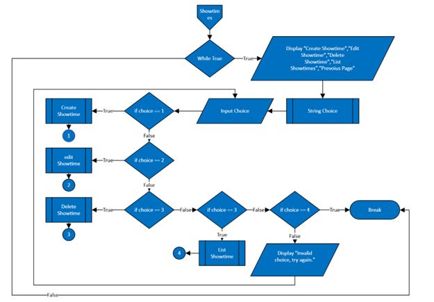

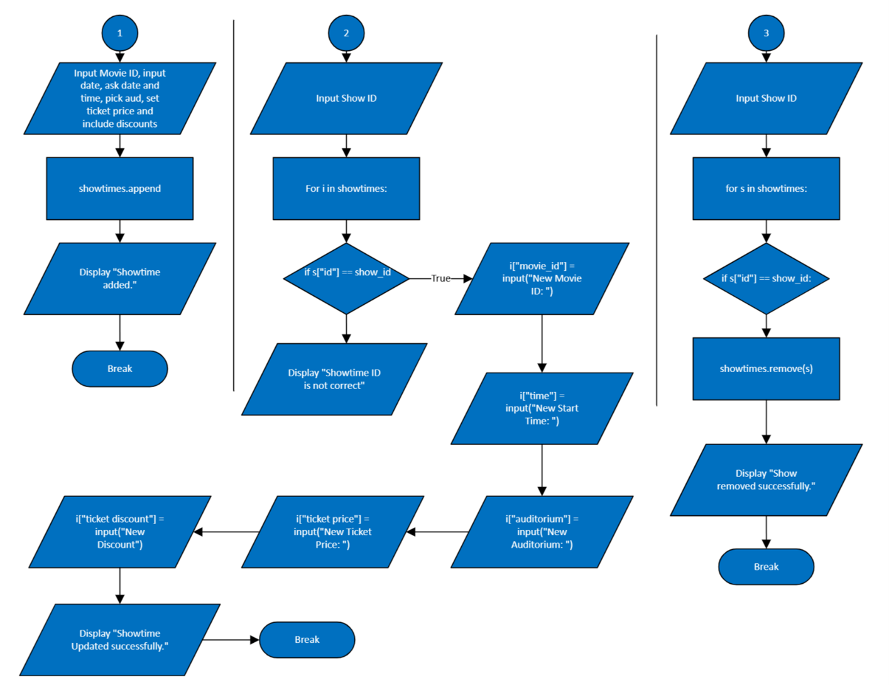

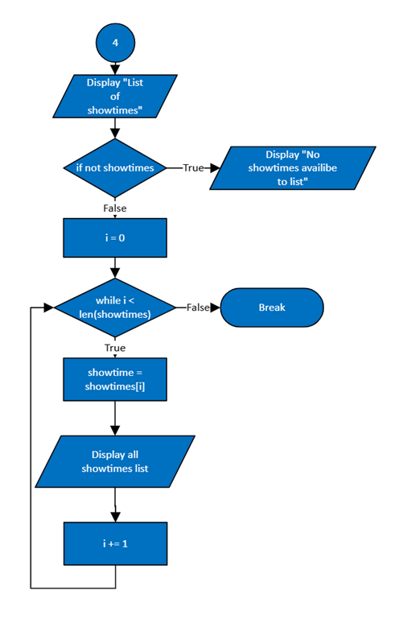

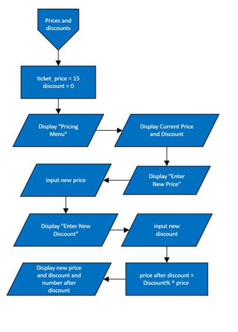

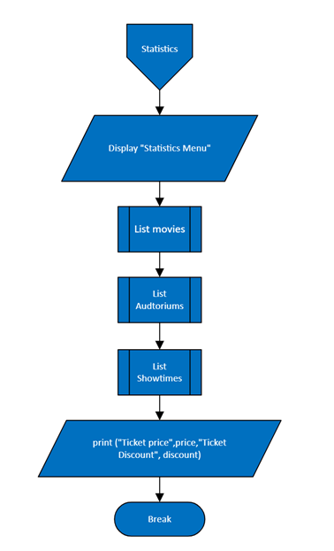

## What We Learned

- Strengthened Python fundamentals through functions, loops, conditionals, and menu-driven programming
- Practiced file handling by reading from and writing to text files for simple data persistence
- Improved problem-solving skills through booking, scheduling, validation, and role-based workflows
- Gained experience debugging and testing a larger command-line program
- Developed teamwork and integration skills in an academic group project

## Future Improvements

- Add a graphical user interface for a more user-friendly experience
- Replace text-file storage with a database such as SQLite or MySQL
- Improve data validation and error messages across all user roles
- Separate the program into smaller modules for easier maintenance
- Add automated tests for booking, login, schedule, and manager workflows

